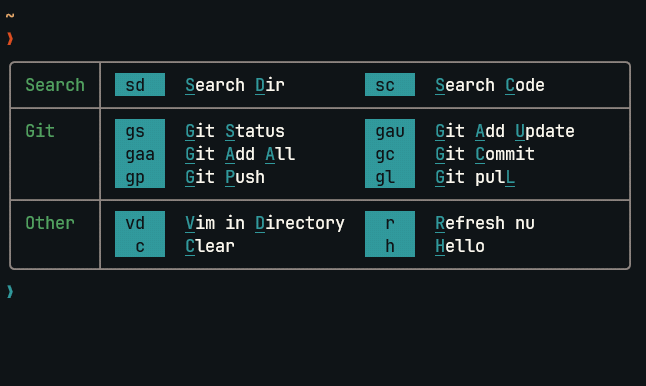

# Me.nu
A quick launch menu for Nushell.
<p align="center">
  
</p>

## 💡 Prerequisites
Just [Nushell](https://github.com/nushell/nushell)

> **Warning**  
> This doesn't work with Nushell 0.85.0
> As of writing this (23/10/03) it requires building the lates nu version, after PR #10572
> 
> Using it with previous version is possible but requires editing the very last line of `me.nu`
> Simply remove the `--env` flag in after the `do` command.
> The only downside is that commands that modify the env, such as those that navigate the filesystem like `cd`, won't work.

## ⬇️ Installation

1. Download the `me.nu` script in a folder, such as `~/.config/me.nu`
2. In your config in `$nu.config-path` source the script by adding 
```bash
source '~/.config/me.nu`  # Or another path
```
3. Define your commands. You can follow the example at [here](https://github.com/ClipplerBlood/me.nu/blob/main/menu_config.nu) for some inspiration.

## 🔧 Defining commands
The menu searches for the variable `$env.nu_menu_commands`, which should be defined as a `List<Record>` with the following structure:
```bash
$env.nu_menu_commands = [
  {
    description: "Hello World"  # Description to be displayed. Capital letters will be underlined
    keymap: "hw"  # Keys to invoke the command
    command: { print "Hello World" }  # **Closure** that will be invoked
    group: "Examples"  # [Optional] group of the command
  }
]
```


> **Note**  
> Commands must have unique keymaps!

### Example config
Check out [menu_config.nu](https://github.com/ClipplerBlood/me.nu/blob/main/menu_config.nu) for some Telescope.nvim inspired commands!

## 🚀 Usage
By default the menu launches with `Ctrl + Space`.

### Executing commands
After launching the command you can enter your sequence of characters to execute the command.
In our example, we can press `h` followed by `h` to print an hello world.

### Sharing roots
In case of commands with the same prefix, for example a command `hn` that prints "Hello Nu", when pressing the first `h` key 
the table output would display the commands that have the `h` root.


### Editing the command
Starting the command sequence with a `Space` enters the *"Edit Mode"*. After inserting the sequence, instead of executing
the command directly, the command will be inserted in your commandline for further editing. 

For example by pressing `<space>hh` the commandline will be set to `> print "Hello World"`. This can be useful for passing flags to your own commands when required.


### Other keys
- Enter and Esc will close the menu
- Backspace will delete the last character (including space)
- Uppercase characters are allowed


## ❤️ Contributing
Feel free to contribute! PRs are welcome!

## 🚚 Roadmap
- [ ] Install script
- [ ] Nupm compatibility


